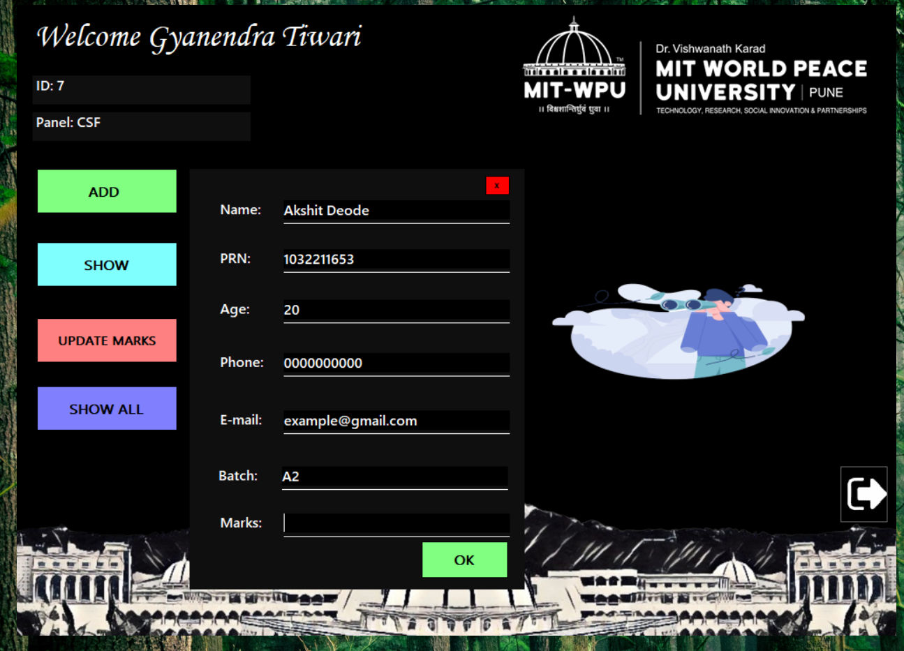
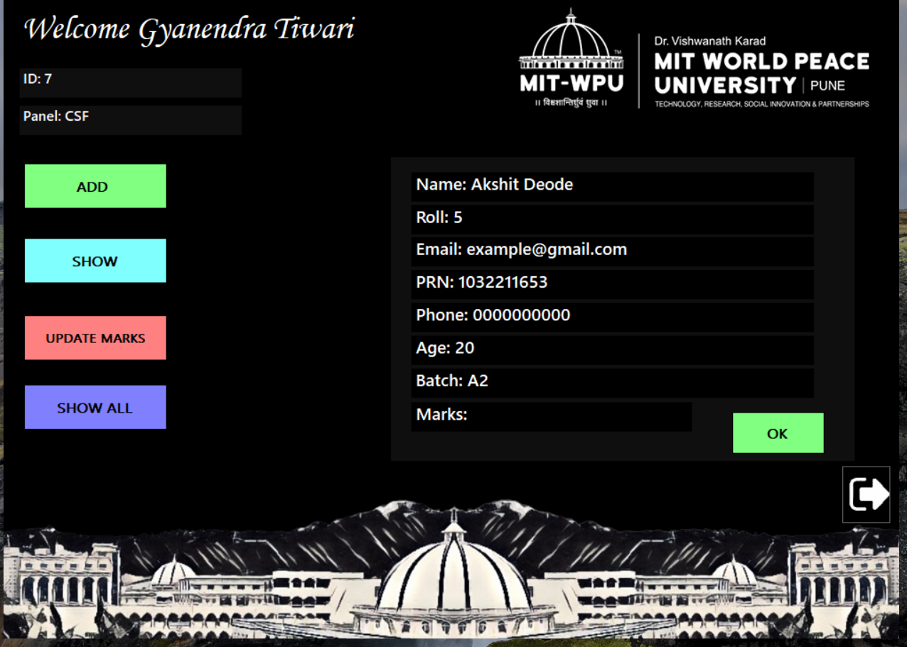
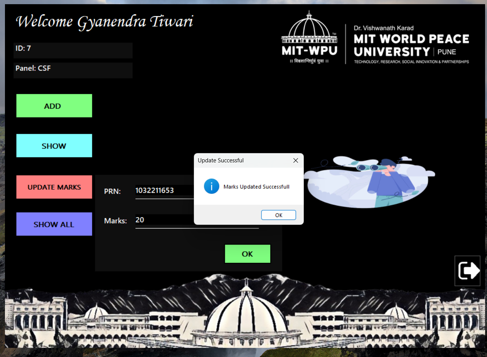

# Guru (Student Management System)

### Guru is a student management system developed using Visual C++ on Visual Studio. It uses the concepts of OOP and SQL.

## Screenshots

## Features

1. A teacher can register herself for a class.
2. Teachers can add students in their class and update the marks.
3. Teachers can get the details of the particular student by searching their roll number.
4. Students can view their marks in the students section by entering their roll number.

## Requirements

1. Visual Studio 2019 or later
2. Windows 10 or later
3. SQL Server 2019 or later

## Installation

1. Clone the repository from GitHub.
2. Open the solution file in Visual Studio.
3. Install the required NuGet packages.
4. Create a new SQL Server database .

## Usage

The application has two main sections: Teacher and Student.

Teacher: The teacher section allows teachers to register for a class, add students, update marks, and get student details.
Student: The student section allows students to view their marks.

## Author

This project is creaed by Gyanendra Tiwari
